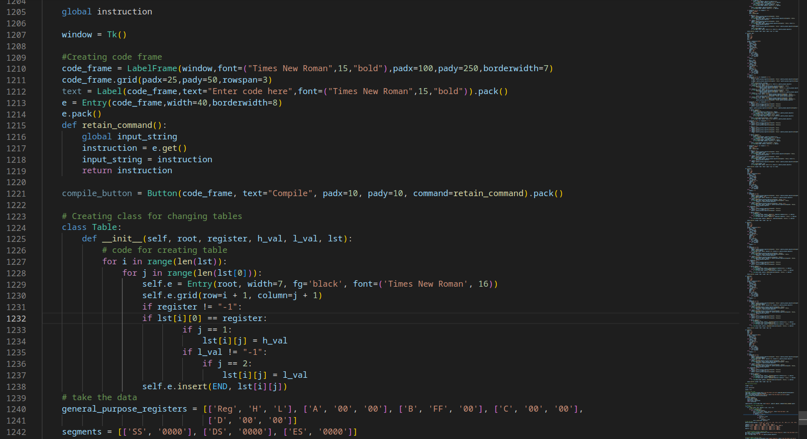

## Technology Used
- Python 
- Tkinter 
- Pygame

    
    
    
    
    
    
    
    

## What it Does
- Calculation of machine code according to user input
- Calculation and assignment of register values according to user input
- Helps in simulation of instruction (in Task-2) according to 8086
- Highlighting of specific boxes and arrows (red, blue and green colour) which are used in processing (Task-2)
    - Colour decryption key is available in GUI
    - If memory is involved in operation (either in operand1 or operand2) stacks, summation, BIU and second command in queue will be highlighted
    - If memory is not involved, there will be only one operation in the queue. Only the registers involved will be highlighted (red for operand1 and green for operand2)
    - In case of XOR,ADD,SUB,INC,DEC,NOT,AND,OR ALU will be used
    - In case of single operand operations, only red colour will highlight the operand

## Example use of all instructions
1. MOV 
    - mov ax,bx
    - mov ax,[1]
    - mov [1],ax
2. Increment 
    - inc ax
3. Decrement 
    - dec ax
4. Negate
    - neg ax
5. XOR
    - xor ax,bx
6. AND
    - and ax,bx
7. OR
    - or ax,bx
8. NOT
    - not ax
9. ADD
    - add ax,bx
10. SUB
    - sub ax,bx
11. COMPLEMENT
    - comp ax
